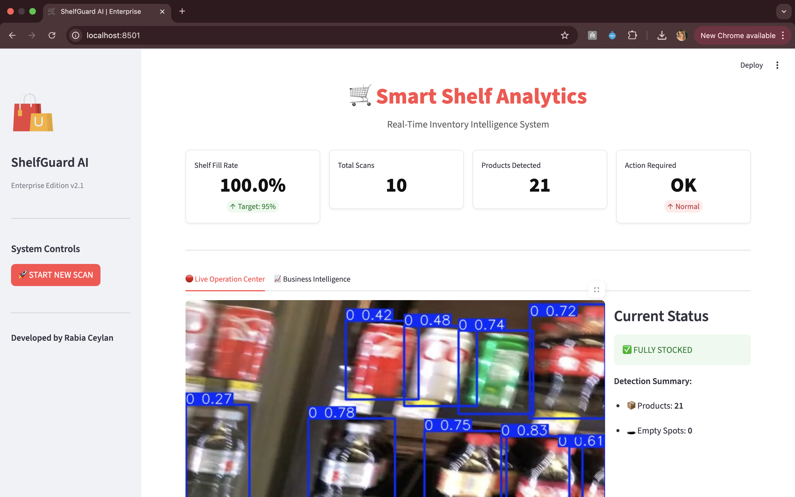
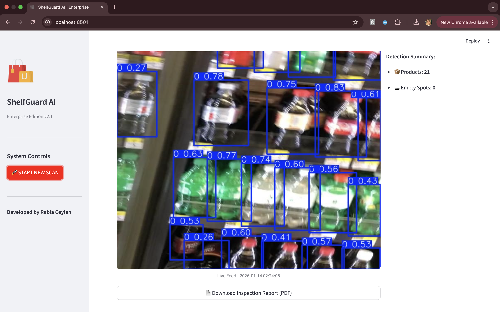
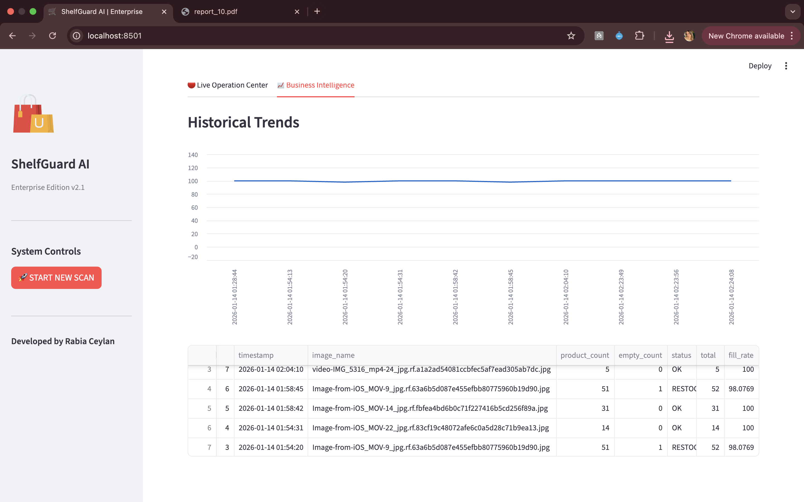

```markdown
# 🛒 ShelfGuard AI | Enterprise Retail Analytics


## 🚀 Overview
**ShelfGuard AI** is an end-to-end computer vision solution designed to automate inventory management in retail environments (e.g., Supermarkets, Warehouses). 

Moving beyond simple object detection, this application serves as a **Business Intelligence Dashboard** that monitors stock levels in real-time, calculates shelf efficiency (Fill Rates), and generates automated inspection reports. It addresses the critical "Out-of-Stock" problem by simulating proactive alerts for store managers.

## 🌟 Key Features (Enterprise Edition)

### 1. 🧠 AI-Powered Detection
- Utilizes **YOLOv8 (Transfer Learning)** to detect products and empty shelf spaces with high precision.
- Optimized for real-time inference on CPU.

### 2. 📊 Interactive Dashboard
- **Simulation Mode:** Trigger AI scans directly from the UI without touching the terminal.
- **KPI Monitoring:** Tracks "Shelf Fill Rate (%)", Total Scans, and Critical Gaps.
- **Clean UI:** Professional, high-contrast design optimized for readability.

### 3. 📄 Automated Documentation
- **One-Click PDF Reports:** Generates professional inspection reports containing timestamp, status metrics, and visual evidence.
- **Audit Trail:** Every scan is logged into a local **SQLite database** for historical analysis.

### 4. 🚨 IoT & Alert Simulation
- **Smart Notifications:** Simulates sending alerts to Store Managers (via Telegram/SMS API integration) when stock levels drop below the threshold.
- **Visual Feedback:** Critical status indicators and toast messages within the app.

## 🛠️ Tech Stack
| Component | Technology | Description |
|-----------|------------|-------------|
| **AI Core** | Ultralytics YOLOv8 | Object Detection Model |
| **Frontend** | Streamlit | Interactive Web Dashboard |
| **Backend** | Python & Pandas | Business Logic & Data Processing |
| **Database** | SQLite3 | Persistent Data Logging |
| **Reporting** | FPDF | Dynamic PDF Generation |
| **Vision** | OpenCV (Headless) | Image Processing |

## 📸 Screenshots
### 1. Main Dashboard Overview
*Real-time KPIs, simulation controls, and status alerts shown in different states.*


<br>


### 2. Detailed Analysis Views

#### 🔴 Live Operation Center Tab
*Detailed view of the processed image and detection summary.*


#### 📄 Generated PDF Report Sample
*Automated professional documentation ready for download.*


## 📦 Installation & Setup

1. **Clone the Repository:**
   ```bash
   git clone [https://github.com/rbacyln/smart-shelf-analytics.git](https://github.com/rbacyln/smart-shelf-analytics.git)
   cd smart-shelf-analytics

```

2. **Create Virtual Environment:**
```bash
python3 -m venv venv
source venv/bin/activate  # On Windows: venv\Scripts\activate

```


3. **Install Dependencies:**
```bash
pip install -r requirements.txt

```


## ▶️ Usage

### Running the Web Application

Launch the full dashboard with a single command:

```bash
streamlit run dashboard.py

```

*The application will open automatically in your default web browser (http://localhost:8501).*

### How to Use

1. **Sidebar:** Click the **"🚀 START NEW SCAN"** button to simulate a live camera feed analysis.
2. **Dashboard:** View real-time KPIs, Fill Rates, and visual results.
3. **Reports:** Go to the "Live Operation Center" tab and click **"Download Inspection Report (PDF)"**.

## 📊 Dataset

The model was trained on the [Retail Shelf Dataset](https://universe.roboflow.com/) utilizing annotated images for 'Product' and 'Empty' classes.

---

**Developed by Rabia Ceylan** 
